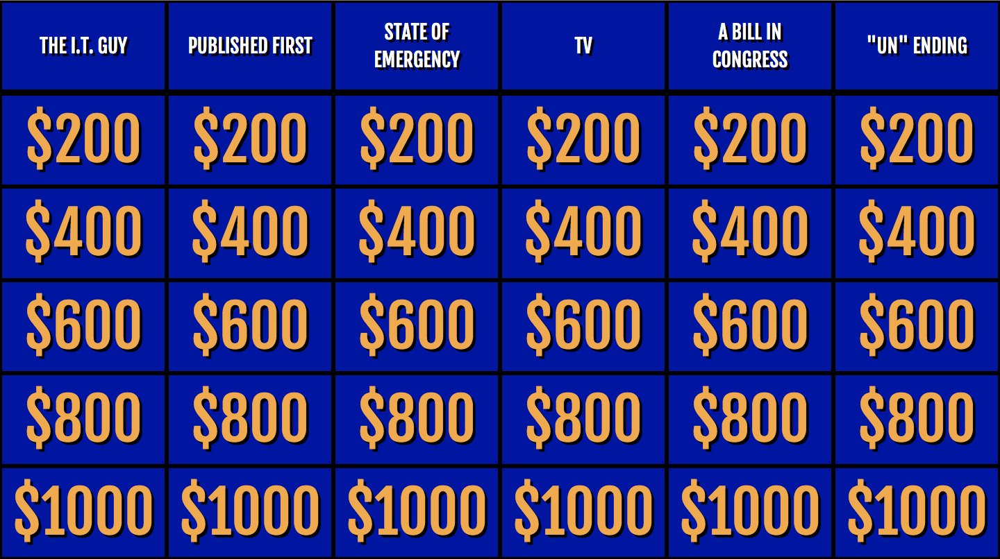
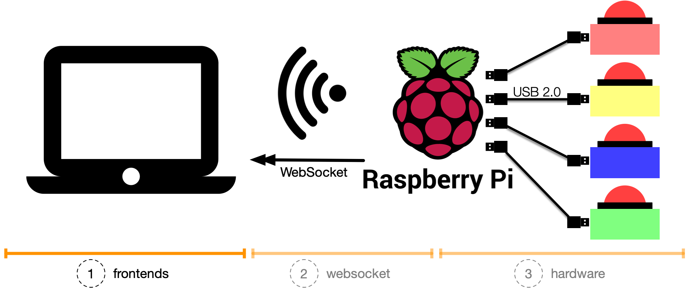
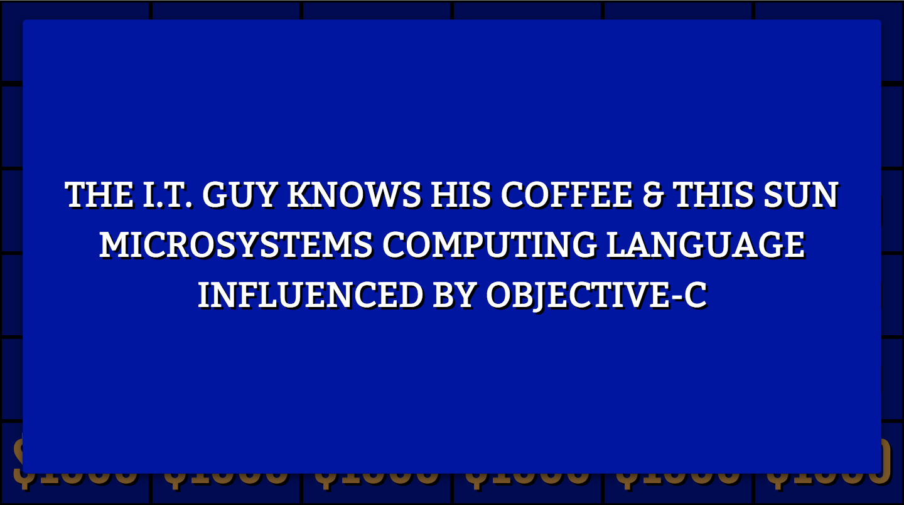
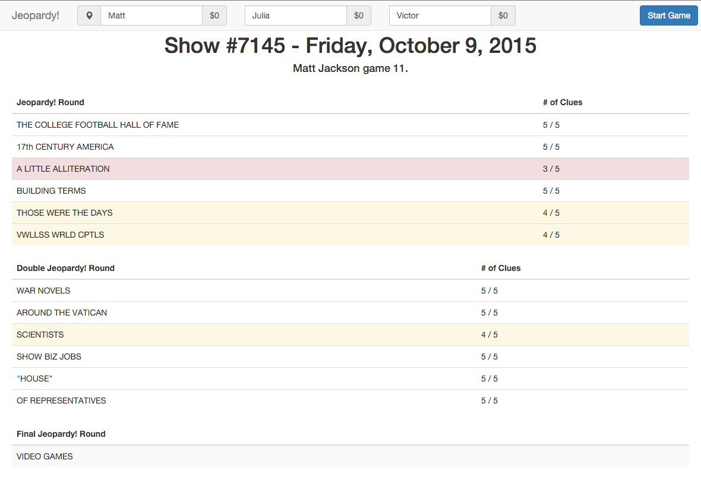
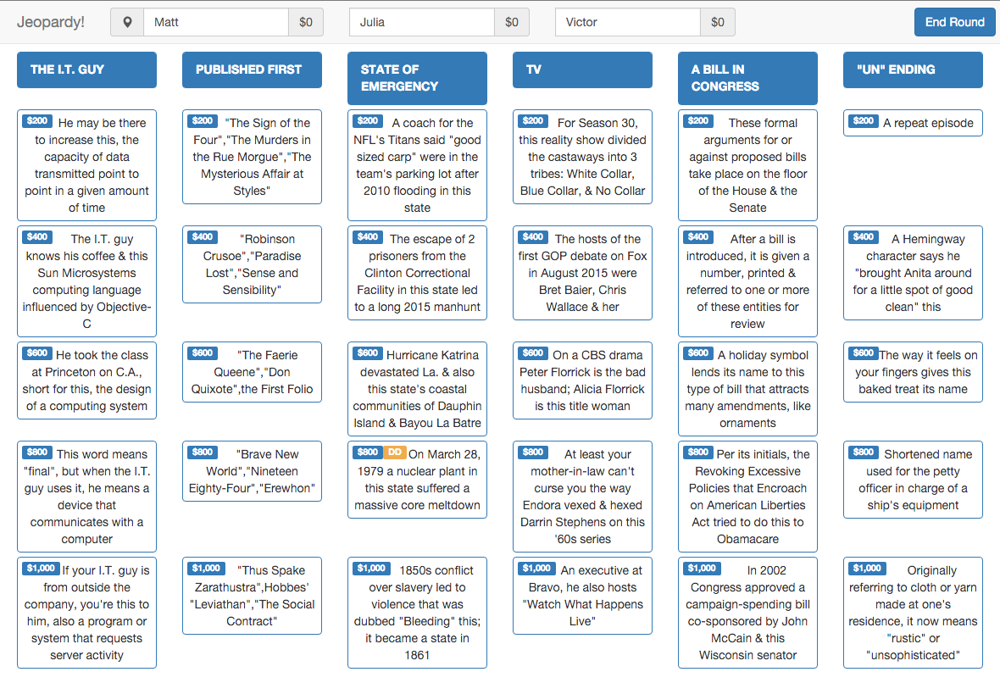
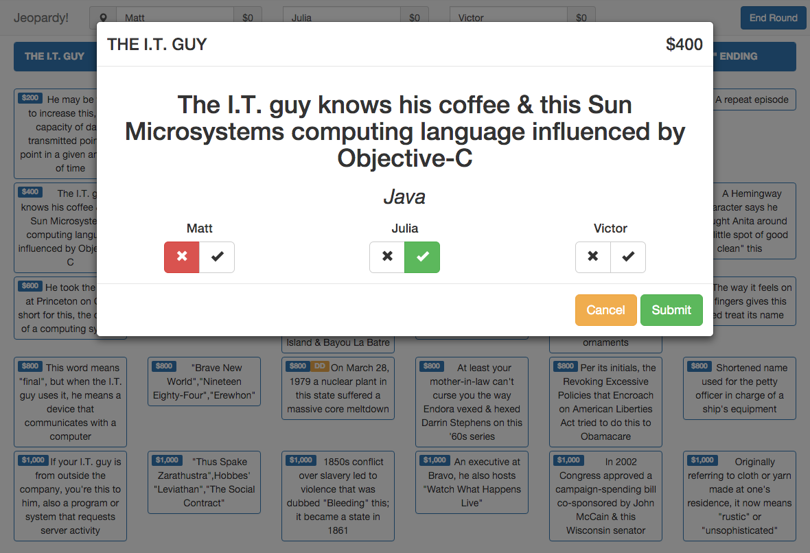

# things with buzzers: Jeopardy!

A [Jeopardy!](https://en.wikipedia.org/wiki/Jeopardy!) game frontend for _things with buzzers_.

<p align="center">
  
</p>

PS: We didn't create this from scratch. This is a modified fork. See [Fork and acknowledgments](#fork-and-acknowledgments).

<p align="center">
  
</p>

_You are missing the context, what this is all about?_
Have a look at

* [(2) things with buzzers: websocket](https://github.com/andygrunwald/things-with-buzzers-websocket)
* [(3) things with buzzers: hardware](https://github.com/andygrunwald/things-with-buzzers-hardware)

## Table of Contents

- [Features](#features)
- [Screenshots](#screenshots)
  - [Game Board (Frontend)](#game-board-frontend)
  - [Game Host Interface (Backend)](#game-host-interface-backend)
- [Getting Started](#getting-started)
  - [Running the App (locally)](#running-the-app-locally)
  - [Running the App (with Docker) => TODO](#running-the-app-with-docker--todo)
  - [Starting a Game](#starting-a-game)
  - [Playing the Game](#playing-the-game)
  - [Create your own game and answer/question set](#create-your-own-game-and-answerquestion-set)
    - [Adding a new _Season_](#adding-a-new-_season_)
    - [Adding a new _Game_ in an existing _Season_](#adding-a-new-_game_-in-an-existing-_season_)
      - [Double Jeopardy! Round](#double-jeopardy-round)
      - [Final Jeopardy! Round](#final-jeopardy-round)
      - [Question with Audio support](#question-with-audio-support)
      - [Question with Image support](#question-with-image-support)
      - [Question with Video support](#question-with-video-support)
  - [Activating the J! Archive games](#activating-the-j-archive-games)
- [Known Issues](#known-issues)
  - [Only when using J! Archive](#only-when-using-j-archive)
  - [Only when running offline](#only-when-running-offline)
- [Fork and acknowledgments](#fork-and-acknowledgments)
- [Disclaimer](#disclaimer)

## Features

* Text support for answers
* Audio support for answers
* Video support for answers
* Native support for _[things with buzzers: hardware buzzers](https://github.com/andygrunwald/things-with-buzzers-hardware)_ via _[things with buzzers: websocket](https://github.com/andygrunwald/things-with-buzzers-websocket)_
* Possibility to run offline
* Support for your own game and answer/question sets
* Support for using the game and answer/question sets from [J! Archive](http://www.j-archive.com/) (_deactivated in favor of your own question sets_)

## Screenshots

### Game Board (Frontend)

A single question

<p align="center">
  
</p>

### Game Host Interface (Backend)

Backend game overview

<p align="center">
  
</p>

Backend game question overview

<p align="center">
  
</p>

Backend game question

<p align="center">
  
</p>

## Getting Started

[If you don't have a buzzer, build one](https://github.com/andygrunwald/things-with-buzzers-hardware)!

Here we run the Jeopardy! app with our example question set from the [`game-content`](./game-content/) folder.
Be aware that there is only one full game available.
Hence the clickpath is important:

  Example Season 2 -> Example Season 2 - Game #1

### Running the App (locally)

This app runs on [Node.js](https://nodejs.org/), make sure to install it before continuing.
Furthermore, we run this game in combination with [twb-websocket](https://github.com/andygrunwald/things-with-buzzers-websocket).

_Important_: The [twb-jeopardy](https://github.com/andygrunwald/things-with-buzzers-jeopardy) app and the [twb-websocket](https://github.com/andygrunwald/things-with-buzzers-websocket) must run on the same server.

1. Clone the [twb-jeopardy](https://github.com/andygrunwald/things-with-buzzers-jeopardy) repository to your computer
  ```sh
  $ git clone git@github.com:andygrunwald/things-with-buzzers-jeopardy.git
  $ cd things-with-buzzers-jeopardy
  ```
2. Download, install and start [twb-websocket](https://github.com/andygrunwald/things-with-buzzers-websocket)
3. Copy the game questions from the [game-content](https://github.com/andygrunwald/things-with-buzzers-jeopardy/tree/master/game-content) folder into the `static/twb-jeopardy/` folder of [twb-websocket](https://github.com/andygrunwald/things-with-buzzers-websocket):
  ```sh
  $ mkdir -p <folder-of-twb-websocket>/static/twb-jeopardy/
  $ cp game-content/* <folder-of-twb-websocket>/static/twb-jeopardy/
  ```

  As an alternative, you can symlink it:
  ```sh
  $ ln -s <folder-of-twb-jeopardy>/game-content <folder-of-twb-websocket>/static/twb-jeopardy/
  ```
4. Install dependencies:
  ```sh
  $ npm install && bower install
  ```
5. Start the app _things with buzzers: Jeopardy!_ app:
  ```sh
  $ TWB_QUESTION_SERVER="localhost:8080" node app.js
  ```
5. Open http://localhost:3000/ for the host interface.
6. Open http://localhost:3000/#/board for the clue board.

It is required to set the _TWB_QUESTION_SERVER_ environment variable.
This the IP + Port combination of the [twb-websocket](https://github.com/andygrunwald/things-with-buzzers-websocket) server.

### Running the App (with Docker) => TODO

TODO

### Starting a Game

Once the server is started, the board will play the Jeopardy! theme to get your contestants pumped up.
The host can then select from any game (on J! Archive or your own created question set), starting by season, then drilling down to individual games.
When the host chooses a game, a summary screen will appear, showing the categories for the game and how many clues are available for each category.
We recommend finding a game with all the clues available for the best experience.

Once the game has been chosen, the host enters the contestant names at the top of the screen and clicks the "Start Game" button.
The music ends on the board and the Jeopardy! round will be displayed.

### Playing the Game

This is pretty easy for the contestants, the person in control of the board picks a clue, the host reads it, they hit the buzzer to answer, repeat until no clues remain.

If you've decided to step into the shoes of [Alex Trebek](https://en.wikipedia.org/wiki/Alex_Trebek), you'll have to learn a bit.

There's a pin next to the name of the player in control of the board.
Call on them to pick a clue.
Click on the clue, and it will pop up on your screen as well as the board.
Read it to the contestants, and they buzz to answer.
Your screen will also have the answer, so be sure not to read that!
If someone buzzes in and gets it wrong, click the X underneath their name.
If they get it right, hit the checkmark.
Hit the Submit button to end the clue and update scores.
The control pin will automatically switch to whichever player answered correctly.
If no one gets it right, control of the board does not change.

If you see a yellow "DD" next to a clue, it's a Daily Double!
Don't start reading it right away!
The contestant who got it needs to bid first.
Make sure the correct name is highlighted, enter the contestant's bid, then hit the Confirm button.
Now read the clue and record whether they get it correct.

If you see a red "TS" next to a clue, that means it was a Triple Stumper on the show.
Nothing too significant, but sometimes it's nice to tell your contestants they're smarter than the folks on the show that day!

When all the clues are gone, hit the "End Round" button.
Between the Jeopardy! and Double Jeopardy! rounds, the contestants' scores will be displayed on the board, and control will be given to the player with the lowest score.

When you reach Final Jeopardy!, you must enter the contestants' wagers before the question is displayed.

If you really want to get serious, there will be a link to J! Archive's wagering suggestions page, automatically populated with your contestants' names and scores.
If you're actually practicing for Jeopardy!, you'd better be learning how to wager properly.
Confirm the wagers, read the question (the Think! music will automatically start playing), let your contestants write down their answers, then enter the results.
Hit the "End Round" button one last time to display your contestants' final scores on the big screen, and you're all done!

Let's reiterate that, be sure to hit "End Round" at the end of Final Jeopardy!
This will display the final scores, as well as save a log of the game's results to a file on your computer in the `games` folder.
You are also given some convenient links to the J! Archive so you can see how the real game played out.
You can then use the "Reset Game" button if you'd like to play again or use your browser's Back button to go back and pick another game.

### Create your own game and answer/question set

It is possible to create your own answer/question sets.
We provide one full example in the [`game-content`](./game-content/) folder.

To the general structure:
* There can be one up to n _Seasons_.
* One _Season_ can contain one up to m _Games_.
* One _Game_ contains one Jeopardy! Game.

#### Adding a new _Season_

1. Open the [`seasons.json`](./game-content/seasons.json).
2. Add the following content (adjust it to your needs):

   ```json
   {
      "id": "my-new-funny-event",
      "name": "Funny Event (March 2019 in DUS)",
      "description": "Put a useful description here. Maybe Location, date or topic of the game.",
      "note": "A random note you can put here"
   }
   ```
3. Create a new file names `my-new-funny-event.json` (like the `id` you entered in the `seasons.json`) and add the content:

   ```json
   [
    {
        "id": "my-new-funny-event-game-1",
        "name": "Funny Event - Game #1",
        "description": "Game #1 of my funny event - Blue edition",
        "note": ""
    },
    {
        "id": "my-new-funny-event-game-2",
        "name": "Funny Event - Game #2",
        "description": "Game #2 of my funny event - Red edition",
        "note": ""
    },
    [...]
   ]
   ```

#### Adding a new _Game_ in an existing _Season_

1. Add a file named `my-new-funny-event-game-1.json` (like the `id` you entered in the `my-new-funny-event.json`) in the game folder and add the following content:

   ```json
   {
      "id": "my-new-funny-event-game-1",
      "game_title": "Show #7929 - Thursday, February 14, 2019",
      "game_comments": "",
      "game_complete": true,
      "category_J_1": {
        "category_name": "THE TOP 25 ROMANTIC COMEDIES",
        "category_comments": "(Alex: According to a list put together by Vanity Fair.)",
        "clue_count": 5
      },
      "category_J_2": {
        [...]
      },
      [...]
      "clue_J_1_1": {
        "id": "359675",
        "clue_html": "He stars in No. 4, No. 7 &amp; No. 16: <br>&quot;Bridget Jones&apos;s Diary&quot;, &quot;Notting Hill&quot; &amp; &quot;Four Weddings and a Funeral&quot;",
        "clue_text": "He stars in No. 4, No. 7 & No. 16: \"Bridget Jones's Diary\", \"Notting Hill\" & \"Four Weddings and a Funeral\"",
        "correct_response": "Hugh Grant"
      },
      "clue_J_2_1": {
        "id": "359682",
        "clue_html": "No bull--we&apos;re stuck on this brand whose mascot is seen <a href=\"http://www.j-archive.com/media/2019-02-14_J_11.jpg\" target=\"_blank\">here</a>",
        "clue_text": "No bull--we're stuck on this brand whose mascot is seen here",
        "correct_response": "Elmer\\'s Glue",
        "media": [
            "http://localhost:3000/media/2019-02-14_J_11.jpg"
        ]
      },
      "clue_J_2_4": {
        "id": "359680",
        "daily_double": true,
        "clue_html": "Napoleon was heard to say that this, which he was part of, is merely &quot;a fable agreed upon&quot;",
        "clue_text": "Napoleon was heard to say that this, which he was part of, is merely \"a fable agreed upon\"",
        "correct_response": "history"
      },
      [...]
   ```

   - `category_J_<CAT_ID|1..6>`: A single category. Six categories can be placed there.
   - `clue_J_<CAT_ID>_<QUESTON_ID|1..5>`: A single question. `clue_J_1_2` will be in category 1 question 2

This is how a regular game looks like.
Additionally, you can add a Double Jeopardy! and Final Jeopardy! Round.

##### Double Jeopardy! Round

Double Jeopardy! Rounds apply the same scheme as normal Categories and Questions.
The difference is that in the JSON Key, the `J` will be replaced with a `DJ`.
Like

```json
    [...]
    "category_DJ_6": {
        "category_name": "TV REBOOTED",
        "category_comments": "",
        "clue_count": 5
    },
    "clue_DJ_1_1": {
        "id": "359705",
        "clue_html": "Now in their 40s, this title trio returns to fight for justice in Dumas&apos; &quot;Twenty Years After&quot;",
        "clue_text": "Now in their 40s, this title trio returns to fight for justice in Dumas' \"Twenty Years After\"",
        "correct_response": "the Three Musketeers"
    },
    [...]
```

##### Final Jeopardy! Round

Only one final Jeopardy! round can be added.
Just add the following into the `my-new-funny-event-game-1.json` file:

```json
    "category_FJ_1": {
        "category_name": "COLORFUL GEOGRAPHY",
        "category_comments": ""
    },
    "clue_FJ": {
        "clue_html": "Named for a soldier killed in 1846 at the start of a war, it was in the news again as a port of entry to the U.S. in 2018",
        "clue_text": "Named for a soldier killed in 1846 at the start of a war, it was in the news again as a port of entry to the U.S. in 2018",
        "correct_response": "Brownsville"
    }
```

##### Question with Audio support

```json
  "clue_J_6_5": {
    "id": "20190319165",
    "clue_html": "",
    "clue_text": "",
    "correct_response": "Valve Theme (Half-Life / Counter Strike)",
    "audio": "http://localhost:8080/static/twb-jeopardy/my-new-funny-event-game-1/Valve-Theme-Hazardous-Environments.mp3"
  }
```

##### Question with Image support

```json
  "clue_J_1_5": {
    "id": "20190319115",
    "clue_html": "",
    "clue_text": "",
    "correct_response": "Batman",
    "media": [
      "http://localhost:8080/static/twb-jeopardy/example-season-2-game-1/batman.png"
    ]
  },
```

##### Question with Video support

```json
  "clue_J_1_5": {
    "id": "20190319115",
    "clue_html": "",
    "clue_text": "",
    "correct_response": "Star Wars",
    "video": "http://localhost:8080/static/twb-jeopardy/my-new-funny-event-game-1/star-wars.mp4"
  },
```

### Activating the J! Archive games

If you prefer to play games from [J! Archive](http://www.j-archive.com/) instead of coming up with your own game and answer/question set, you need to modify the source code slightly.

1. Open the [routes/api.js](./routes/api.js) file
2. Search for `J! Archive-Activation`
3. Add comments in front of the lines with `TWB_QUESTION_SERVER`
4. Remove the comments of the lines with http://www.j-archive.com/
5. Restart the game server
6. Seasons and games from http://www.j-archive.com/ should appear now

## Known Issues

* You have to end the round when all clues are answered manually.
* Contestants are only shown their scores between rounds, at Daily Doubles, and before Final Jeopardy! Be a good game master and announce them in between.
* There is no easy way to adjust a contestant's score if the host makes a mistake. When necessary, we just added some scoring notes in the field with the contestant's name.
* There is no way to un-answer a clue or un-end a round. Once they're gone, they're gone, unless the entire game is reset.

### Only when using J! Archive

* Media is proxied from J! Archive, so if a clue had pictures, they would be shown on the game board. However, media frequently comes up missing on J! Archive. The links are there, but they don't go to anything.

### Only when running offline

* The Jeopardy! theme played at the start is streamed from YouTube. We suggest you download the video beforehand and switch to the game once finished.
* You have to use your own game and answer/question set OR downloading the J! Archive games beforehand.

## Fork and acknowledgments

This repository is a (modified) fork of [theGrue/jeopardy](https://github.com/theGrue/jeopardy) which is based on [btford/angular-socket-io-seed](https://github.com/btford/angular-socket-io-seed).

The main acknowledgments belongs to [theGrue](https://github.com/theGrue), [btford](https://github.com/btford) + contributors.
Thanks a lot! You created a huge thing.

## Disclaimer

Borrowing this one from J! Archive, just in case.

> The Jeopardy! game show and all elements thereof, including but not limited to copyright and trademark thereto, are the property of Jeopardy Productions, Inc. and are protected under law. This website is not affiliated with, sponsored by, or operated by Jeopardy Productions, Inc.
